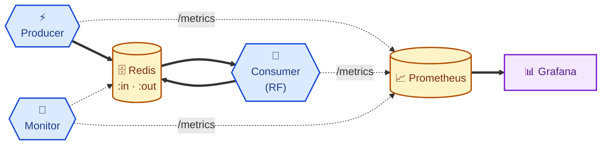
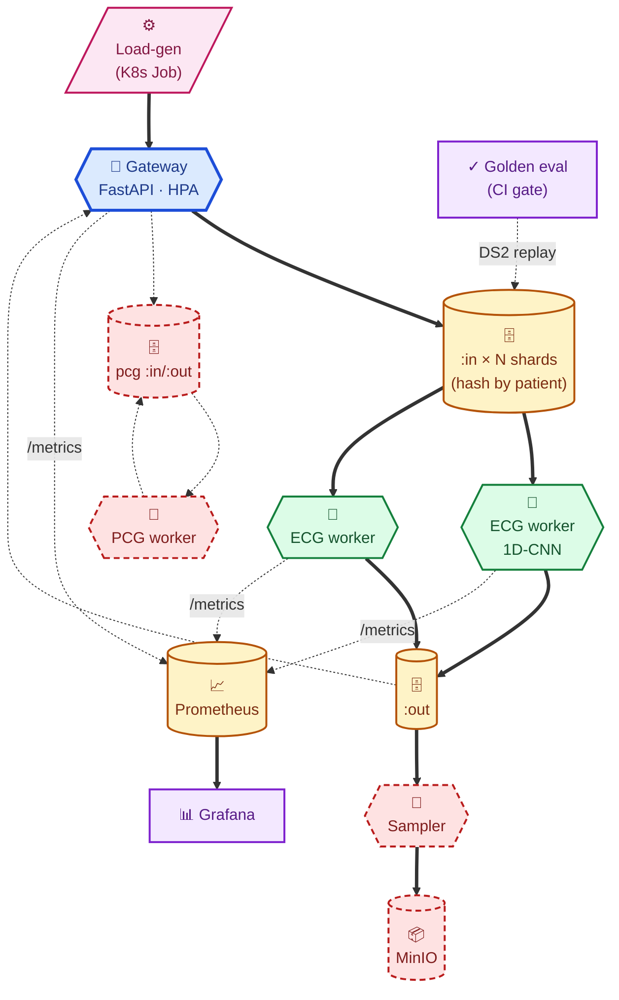

# pulsegate · architecture diagrams

Where the project is now and where it'll be at end of Week 4.
Same skeleton, scaled up — the shape today is the shape at the finish line.

For deeper rationale see `architecture.md` and `design-notes.md`.

---

## Visual language

| Shape | Means |
|---|---|
| `[(  )]` cylinder | persistent store (Redis, Prometheus TSDB, object storage) |
| `{{  }}` hexagon  | long-running process |
| `[/  /]` parallelogram | input / load source |
| `[  ]`  rectangle | UI / read-only viewer |
| ══>  thick arrow | hot data path (per-beat traffic) |
| ─.─>  dashed arrow | control / observability / out-of-band |

---

## Current state · end of Week 2 Step 4 Chunk B

**Verified this morning**:
predict = 26.7 ms = 97% of consumer wall time · lag peaks at ~1376 messages
under sustained 91 b/s in vs ~38 b/s out · 68 tests green.

---

## Target state · end of Week 4

Dashed red boxes = stretch goals (PCG signal type, sampler, MinIO).

---

## What changes between the two

| | **Now** | **Week 4 target** |
|---|---|---|
| **Scale** | 1 producer · 1 consumer · laptop | N pods, HPA on lag, K8s |
| **Streams** | single `:in` / `:out` | sharded by `hash(patient_id) % N` |
| **Routing** | direct XADD/XREAD | Gateway with `request_id` ↔ Future correlation |
| **Model** | RandomForest baseline (F1 0.37) | 1D-CNN (target ~0.55+) |
| **Signals** | ECG only | ECG + PCG (heart-sound stretch) |
| **Eval** | offline harness | golden DS2 replay through live workers, CI-gated |
| **Sampling** | none | stratified slice → object storage |

What stays identical: **producer → Redis stream → consumer → out-stream**, plus
Prometheus + Grafana on the side. The skeleton today is the skeleton at scale.

---

## CV-bridge one-liner

> Production real-time classification platform — sharded Redis Streams,
> multi-consumer worker pods sharing one model instance, request-correlated
> stateless gateway. Same architecture as my prior text/image/video classification
> platform at ~20k msg/s p99 ~100ms, transposed to ECG arrhythmia detection on
> MIT-BIH (PhysioNet).
